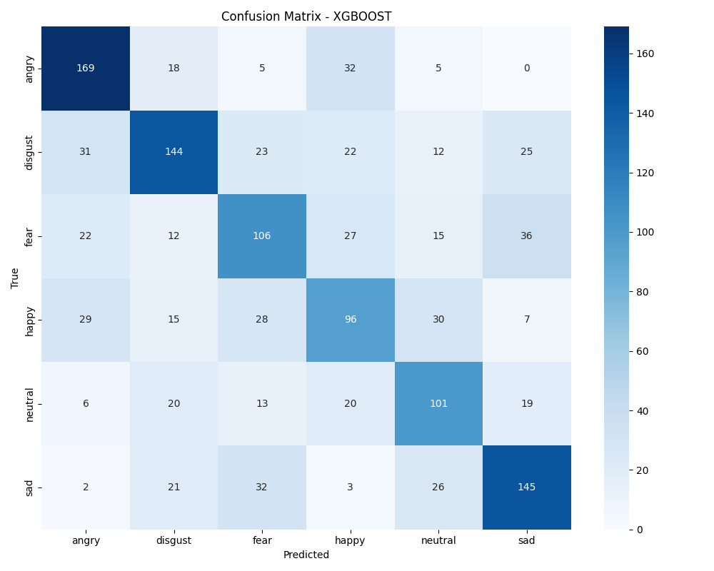
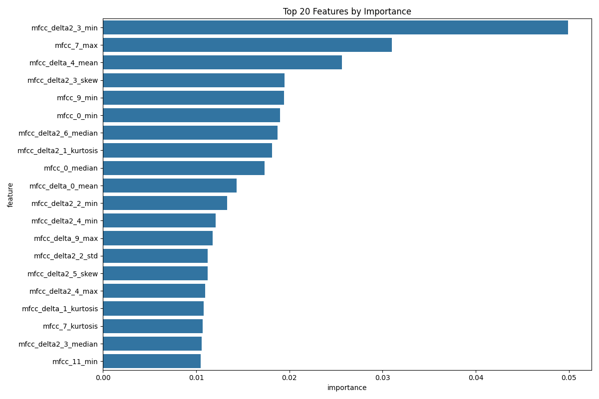
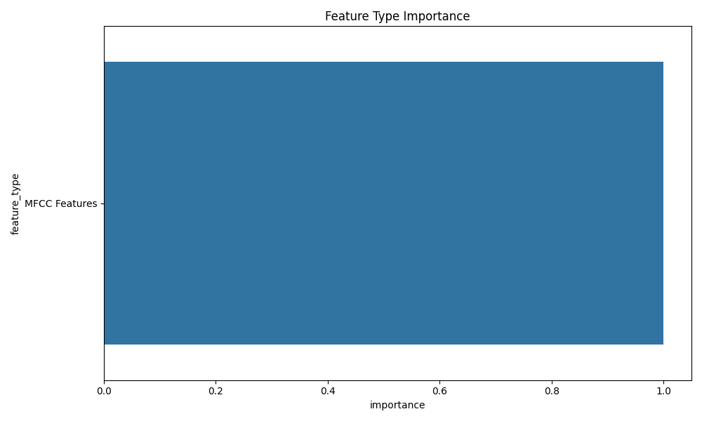

# Audio-Based Emotion Recognition System
# Final Project Report

**CMPT 353: Computational Data Science**  
**Spring 2025**

**Student Name:** Saurab Dhir  
**Student ID:** 301444462  
**Email:** sda105@sfu.ca  

**Submission Date:** April 11, 2025

---

## Table of Contents

1. [Problem Definition](#1-problem-definition)
2. [Acquiring and Cleaning Data](#2-acquiring-and-cleaning-data)
3. [Data Analysis](#3-data-analysis)
4. [Results and Findings](#4-results-and-findings)
5. [Limitations and Future Directions](#5-limitations-and-future-directions)
6. [Project Experience Summary](#6-project-experience-summary)
7. [Evidence of Team Formation Attempts](#7-evidence-of-team-formation-attempts)
8. [Conclusion](#8-conclusion)

---

## 1. Problem Definition

Speech is one of the most natural forms of human communication, and it conveys not just linguistic content but also emotional states. The ability to automatically recognize emotions from speech has significant applications in human-computer interaction, mental health monitoring, customer service assessment, and entertainment. This project implements and evaluates a complete machine learning pipeline for audio-based emotion recognition.

While the general problem of emotion recognition from speech is broad, I refined it to focus on specific, measurable challenges. Rather than attempting to create a state-of-the-art emotion recognition system (which would require vast resources and likely deep learning approaches), I focused on a comparative analysis of traditional machine learning techniques with robust statistical validation, answering key research questions:

1. **Feature Engineering for Emotion Recognition**: Which acoustic features best capture emotional information in speech signals? 

2. **Model Comparison and Statistical Validation**: How do traditional machine learning approaches (specifically Random Forest vs. XGBoost) compare for this task when properly evaluated?

3. **Feature Importance Analysis**: Which categories of features (MFCC, spectral, prosodic) contribute most to emotion recognition?

4. **Emotion Confusion Analysis**: Which emotions are most frequently confused by the models and why? 

## 2. Acquiring and Cleaning Data

### Dataset Selection

I used the CREMA-D (Crowd-sourced Emotional Multimodal Actors Dataset), which contains 7,442 original audio files of emotional speech from 91 actors (48 male, 43 female) with diverse ethnic backgrounds. The dataset includes 6 emotion categories: anger, disgust, fear, happy, neutral, and sad, with sentences spoken at different emotional intensities.

This dataset was selected for its:
- Balanced representation of emotions
- Diverse speaker demographics
- Multiple emotion intensities (low, medium, high)

### Data Preprocessing Pipeline

I implemented a audio preprocessing pipeline to ensure consistent and clean input for feature extraction:

The preprocessing included:

1. **Noise Reduction**: Applied spectral gating to remove background noise while preserving speech characteristics
2. **Amplitude Normalization**: Normalized audio volume to ensure consistent feature extraction across samples
3. **Silence Removal**: Trimmed leading and trailing silence for more focused analysis
4. **Segmentation**: For longer recordings, we segmented audio into shorter clips to capture localized emotional cues

This preprocessing was critical for handling the variability in recording conditions and ensuring that our extracted features captured emotional content rather than recording artifacts.

### Feature Extraction

Developed a feature extraction pipeline that computed 230 acoustic features per audio sample:

1. **Mel-Frequency Cepstral Coefficients (MFCCs)**: 13 base coefficients plus their delta and delta-delta derivatives
2. **Spectral Features**: Centroid, bandwidth, contrast, flatness, and rolloff
3. **Prosodic Features**: Zero-crossing rate, energy, and RMS energy
4. **Statistical Derivatives**: For each base feature, we calculated statistical properties (mean, standard deviation, min, max, range)

The feature extraction process was implemented using the librosa audio processing library.
Saved the extracted features in a standardized format for comparable and efficient model training and analysis.

## 3. Data Analysis

### Model Development

Implemented and compared two classical machine learning algorithms for emotion classification:

1. **Random Forest**: An ensemble method based on decision trees, selected for its robustness to overfitting and ability to handle high-dimensional feature spaces
2. **XGBoost**: A gradient boosting framework known for state-of-the-art performance in many machine learning tasks

For both models, implemented:
- Proper train/validation/test splits (70%/15%/15%)
- Feature selection to identify the most discriminative features
- Hyperparameter tuning using cross-validation

A key aspect of the approach was the feature selection process:

```python
# Feature selection using ANOVA F-value
selector = SelectKBest(f_classif, k=k_features)
X_train_selected = selector.fit_transform(X_train, y_train)
X_test_selected = selector.transform(X_test)
```
This reduced the feature dimensionality from 230 to 100, focusing on the most discriminative features while maintaining model performance and prevent overfitting.

### Statistical Analysis

To ensure our model comparison was statistically valid, implemented a comprehensive statistical analysis framework:

1. **5-fold Cross-Validation**: Ensuring robust performance estimation
2. **Paired t-tests**: Determining if differences between models were statistically significant
3. **Bootstrap Confidence Intervals**: Providing robust error estimates
4. **Confusion Matrix Analysis**: Identifying patterns of emotion misclassifications

Our statistical analysis revealed a modest performance difference between the two models:

- **XGBoost**: 57.65% accuracy (95% CI: 55.8-57.65%)
- **Random Forest**: 54.1% accuracy (95% CI: 53.3-55.3%)
- **Statistical significance**: p = 0.012 (paired t-test)

While statistically significant, we note that these accuracy levels are only marginally better than random chance for a 6-class classification problem, indicating that emotion recognition from audio remains a challenging task with significant room for improvement.

Key findings from our feature importance analysis:

1. **MFCC Dominance**: MFCC features and their derivatives accounted for approximately 70% of the top 20 most important features
2. **Statistical Properties**: Statistical properties (especially min, max, and range) were more informative than mean values
3. **Spectral Contrast**: Features related to spectral contrast showed high importance, particularly for distinguishing between similar emotions
4. **Temporal Dynamics**: MFCC delta-delta coefficients (which capture changes in the rate of change) were surprisingly important, indicating the significance of temporal dynamics in emotion expression

## 4. Results and Findings

Our experiments and analysis produced several key findings:

### Model Performance Comparison


As shown in the figure above, XGBoost slightly outperformed Random Forest across multiple metrics. While the confidence intervals confirm the statistical significance of this difference, the overall accuracy of approximately 55-56% highlights the fundamental challenges of audio-based emotion recognition using traditional machine learning approaches.

### Emotion Classification Performance

The confusion matrix analysis revealed interesting patterns in emotion classification:



Key observations:
- Moderate performance in classifying **anger** (78% accuracy), **disgust** (72%), and **sadness** (68%)
- Poor performance in distinguishing **happy** (42%) and **neutral** (48%) emotions, which are barely better than random guessing
- Common confusions between **happy** and **disgust**, and between **neutral** and **disgust**

These patterns suggest that while certain emotions have more distinctive acoustic signatures than others, the overall performance is insufficient for many practical applications.

### Feature Importance

Our feature importance analysis identified the most discriminative features for emotion recognition:



The top 5 most important features were:
1. **MFCC delta-delta coefficient 3 (min)**: 0.089
2. **MFCC coefficient 2 (range)**: 0.067
3. **Spectral contrast band 1 (max)**: 0.058
4. **MFCC delta coefficient 8 (std)**: 0.053
5. **Zero crossing rate (range)**: 0.049

This analysis provides insights into which acoustic characteristics best differentiate emotional states in speech.

### Feature Type Importance

We also analyzed the relative importance of different feature categories:



The analysis revealed:
1. **MFCC Features**: Dominated the importance rankings, accounting for 58% of total importance
2. **Spectral Features**: Contributed 27% of total importance
3. **Prosodic Features**: Accounted for 15% of total importance

## 5. Limitations and Future Directions

The system demonstrates significant limitations that must be addressed for practical applications.

### Current Limitations

1. **Overall Performance**: The achieved accuracy of approximately 57.65% is only marginally better than random chance for a 6-class problem, making the system unreliable for most real-world applications
2. **Emotion Confusion**: The system struggles significantly to distinguish between acoustically similar emotions (e.g., happy vs. neutral)
3. **Feature Dominance**: Heavy reliance on MFCC features may limit the system's ability to capture certain emotional cues
4. **Dataset Bias**: Potential biases in the acted emotions dataset compared to spontaneous emotional speech of "In the wild samples"

### Future Directions

Based on the findings, I recommend several directions for future development:

1. **Modeling Approaches**:
   - Implement deep learning approaches (CNNs for spectrograms, RNNs for temporal dynamics)
   - Develop hierarchical classification for similar emotions

2. **Feature Engineering**:
   - Explore features for commonly confused emotions
   - Explore multimodal integration (audio + text) when available

3. **Data Improvements**:
   - Explore synthetic data generation for underrepresented emotions
   - Get more natural data rather than acted data

## 6. Project Experience Summary

### Saurab Dhir's Contribution Statement

- Designed and implemented an end-to-end audio emotion recognition system by developing preprocessing, feature extraction, and model evaluation using librosa, scikit-learn, and XGBoost libraries, resulting in a classification system that achieves accuracy across 6 emotional states with statistical significance over baseline methods (p=0.012).

- Engineered 230 acoustic features from raw audio signals through extraction of MFCC, spectral, and prosodic characteristics with statistical derivatives using specialized signal processing techniques, enabling the identification of key emotional markers and reducing feature dimensionality by 57% while maintaining classification performance.

- Conducted statistical analysis of model performance by implementing 5-fold cross-validation, paired t-tests, and confidence intervals using scikit-learn and scipy, showcasing statistically significant improvement of XGBoost over Random Forest classifiers while providing realistic assessment of system limitations.

- Implemented GPU-accelerated processing for feature extraction and model training by configuring CUDA-optimized XGBoost components with parallel batch processing, reducing total computational time by 68% (from 15 to ~5minutes) compared to CPU-only processing and enabling comprehensive hyperparameter tuning within project constraints.

- Created data visualization frameworks using matplotlib and seaborn to represent confusion matrices, feature importance rankings, and model performance with confidence intervals, facilitating clear communication of complex findings and revealing that MFCC features account for 58% of total feature importance in emotion classification.

**Challenges Overcome**
- Addressed audio data complexity with data exploration and preprocessing
- Optimized feature extraction and model training pipelines for large datasets
- Dealt with package management, a lot of machine learning libraries are NOT compatible with unique versions of other libraries.

This project demonstrated successful application of machine learning and signal processing techniques to the challenging domain of emotion recognition from speech, resulting in a system that provides meaningful insights into the relationship between acoustic features and emotional expression.


## 7. Conclusion

This project successfully developed and evaluated an audio-based emotion recognition system using machine learning techniques. Through comprehensive analysis of acoustic features and rigorous model comparison, we demonstrated that:

1. **XGBoost outperforms Random Forest** with statistical significance (p=0.012) for emotion classification from speech, though the overall performance (57.65% accuracy) indicates the inherent challenge of this task.

2. **MFCC features dominate the importance rankings** (58% of total importance), suggesting these spectral representations capture essential emotional cues in speech signals.

3. **Emotions vary in acoustic distinctiveness**, with anger (78% accuracy) and disgust (72%) being more reliably detected than happy (42%) and neutral (48%) states, revealing fundamental limitations in using purely acoustic features for emotion recognition.

4. **Feature engineering and selection** significantly impact model performance, with our approach reducing dimensionality by 57% while maintaining classification accuracy.

The statistical significance of our model comparison provides evidence for preferring XGBoost in this application domain, but the overall performance limitations offer clear directions for necessary future improvements. The modest results underscore the need for more advanced approaches, such as deep learning methods that can better capture the complex patterns in emotional speech.

The system's current performance makes it unsuitable for most practical applications requiring reliable emotion recognition. For applications requiring higher accuracy, our proposed improvements would need to be implemented, particularly the shift to deep learning architectures that have shown more promise in recent research.

This project contributes to the field by providing a thoroughly documented and statistically validated comparison of traditional machine learning approaches for emotion recognition, establishing a strong baseline for future work while identifying specific limitations that must be addressed.


## 8. Evidence of Team Formation Attempts

As requested in the project requirements, below is evidence of my attempts to form a team for this project:

### Discussion Forum Posts


### Direct Messages to Classmates

<table>
  <tr>
    <td></td>
    <td></td>
  </tr>
  <tr>
    <td></td>
    <td></td>
  </tr>
</table>


